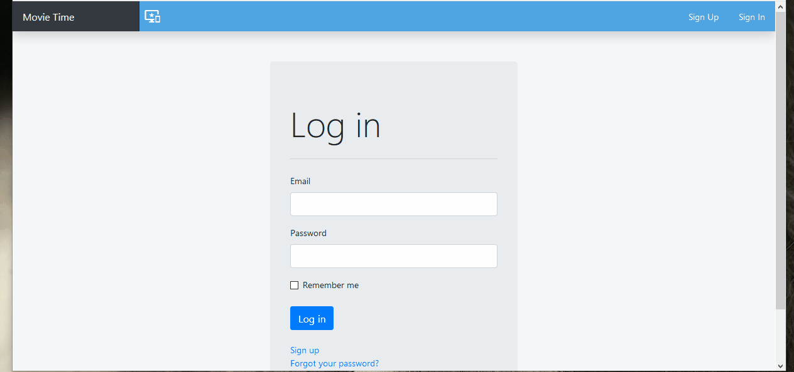

# Movie Time


<br />
<p align="center">
  <a href="https://github.com/simandebvu/movie-time/">
    
  </a>

  <h3 align="center">Movie Time</h3>

  <p align="center">
    This project consists of building a twitter like clone.
    <br />
    <a href="https://github.com/simandebvu/movie-time/"><strong>Explore the docs »</strong></a>
    <br />
    <br />
    <a href="https://github.com/simandebvu/movie-time/issues/">Report Bug</a>
    ·
    <a href="https://github.com/simandebvu/movie-time/">Request Feature</a>
  </p>
</p>

> A redesign of Twitter Converted to be a Movie Themed Twitter. Users can post opinions on movies, follow other users and see their opinions. Feel free to join the couch potates of movie time!



This is the MVP version of the product. Based off on the design by [Gregoire Vella](https://www.behance.net/gallery/14286087/Twitter-Redesign-of-UI-details).

## Built With

- Ruby and Ruby On Rails
- Simple Form
- Devise
- Bootstrap
- PostgreSQL
- VSCode
- Rubocop 
- Sticker
- Github Actions

## Live Demo

[Live Demo Link](https://movie-time-zim.herokuapp.com/)

## Video Presentation

[Video Link](https://www.loom.com/share/6750547f630a4299b89be24c932daf8a)


<!-- INSTALLATION -->
## Usage

To have this app on your pc, you need to:
* have Ruby & Ruby on Rails installed in your computer
* [download](https://github.com/simandebvu/movie-time/development.zip) or clone this repo:
  - Clone with SSH:
  ```
    git@github.com:simandebvu/movie-time.git
  ```
  - Clone with HTTPS
  ```
    https://github.com/simandebvu/movie-time.git
  ```
* and open the terminal inside the repo and run the bundler
  - ```$ bundler install --without production```
* then, run rails db:migrate. This creates the database with the corresponding tables, columns and associations
  - ```$ rails db:migrate```
* then, run rails s. This will start the server at localhost `http://127.0.0.1:3000/`
  - ```$ rails s```
* and finally, you can test it in the console by running
  - ```$ rails console --sandbox```
  
## IMPORTANT

** I used the Figaro gem to store credentials for use with POSTGRES. Therefore, we used SECRET KEYS stored in environment variables on our development and production servers.**

- So if you have postgres credentials create a file an application.yml file inside config/ and put this your credentials in it like showing bellow:

```ruby
DB_USERNAME: your_postgres_username
DB_PASSWORD: your_postgres_password
```

## Running tests

* Get into the folder with the application `movie-time` and open the terminal.
* Type in `rspec`. As soon as you press enter. Tests will start to run.


## Authors

👤 **Shingirayi Mandebvu**

- Github: [@simandebvu](https://github.com/simandebvu)
- Twitter: [@simandebvu](https://twitter.com/simandebvu)
- Linkedin: [linkedin](https://linkedin.com/in/simandebvu)

## 🤝 Contributing

Contributions, issues and feature requests are welcome!

Feel free to check the [issues page](issues/).

## Show your support

Give a ⭐️ if you like this project!

## Acknowledgments

- Microverse
- Gregoire Vella


## 📝 License

This project is [MIT](lic.url) licensed.
